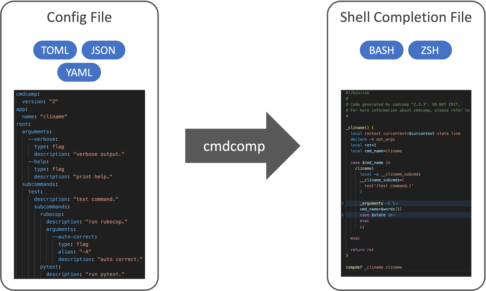

# Command Completion Generator Tool

<!-- --8<-- [start:badges] -->

[](https://yassun7010.github.io/cmdcomp/)
[](https://github.com/yassun7010/cmdcomp/actions)
[](https://pypi.org/project/cmdcomp)
[](https://hub.docker.com/r/yassun7010/cmdcomp)

<!-- --8<-- [end:badges] -->

`cmdcomp` generate command shell completion file (`bash` or `zsh`) from config
`json`/`yaml`/`toml` file.



## Install

```shell
pip install cmdcomp
```

## Usage

```shell
cmdcomp --file $YOUR_CONFIG_FILE --shell-type bash
```

## Documentation

See [documentation](https://yassun7010.github.io/cmdcomp/) for more details.

## Examples

See [examples](https://github.com/yassun7010/cmdcomp/tree/main/examples/v2).
